# 📘 FitTrack – Frontend  
# Sprint 5 – Documentación y Modelado (Frontend)

Este repositorio contiene el **Frontend de FitTrack**, una SPA desarrollada en **React**.  
Su responsabilidad principal es gestionar toda la **interacción del usuario**, comunicar con la **API REST del Backend** y presentar datos visuales coherentes con la arquitectura del proyecto.

Este documento incluye:

- Diagramas de actividad del flujo de usuario  
- Código PlantUML + imagen correspondiente  
- Referencias al backend cuando la lógica pertenece allí  

---

## 🧭 1. Relación con Backend

El Frontend se comunica con la API del Backend mediante HTTP/JSON.  
Toda la capa de lógica de negocio, validaciones, reglas automáticas, repositorios y persistencia está documentada en:

👉 **FitTrack Backend:**  
https://github.com/usuario/FitTrack-Backend

---

## 🎨 2. Estructura del Frontend
```
/src
/components
/pages
/hooks
/services
/docs
/sprint5
/actividades

yaml
```
---

## 🧩 3. Diagramas de Actividad (Frontend)

### A1 – Registro de usuario**

```
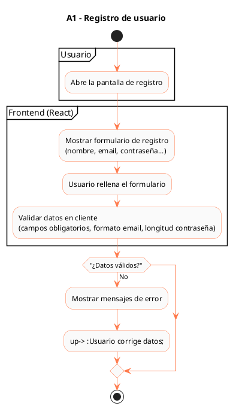


### A2 – Inicio de sesión

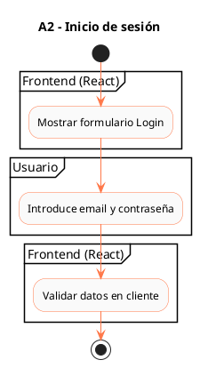

### A3 – Recuperar contraseña

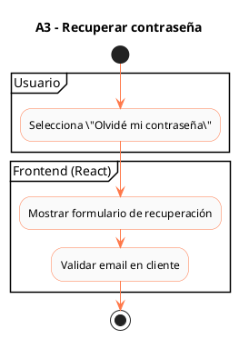

### A4 – Onboarding inicial

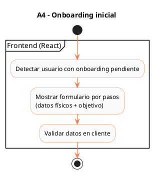

### A5 – Navegación desde Dashboard

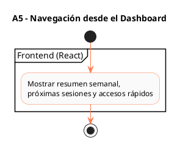

### A6 – Registrar sesión de entrenamiento

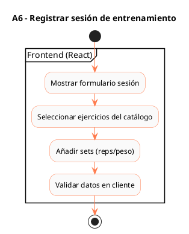

### A7 – Consultar calendario

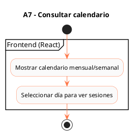

### A8 – Crear objetivo personal

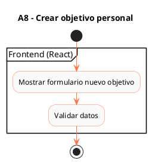

### A11 – Crear publicación

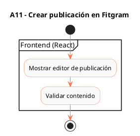

### A12 – Comentar / Like

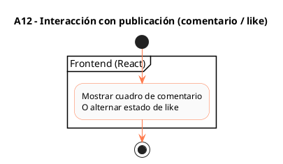

### A13 – Unirse a un reto

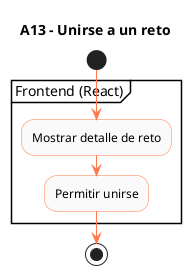

### A14 – Crear reto

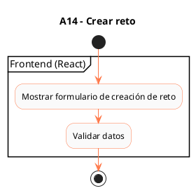

### A15 – Editar perfil

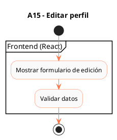

### A16 – Enviar mensaje de soporte

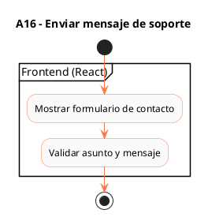

## 🔗 4. Actividades documentadas en el Backend
El diagrama A10 – Desbloqueo automático de logros pertenece al backend
(porque es lógica interna sin intervención del usuario).

Además, el backend contiene:

Diagramas de Secuencia (SD1–SD12)

Diagramas JSON

Diagrama de Componentes

Diagrama IE (MySQL)

Consulta el repositorio:

👉 https://github.com/usuario/FitTrack-Backend